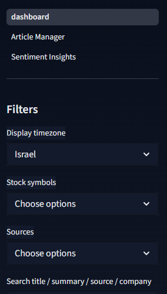
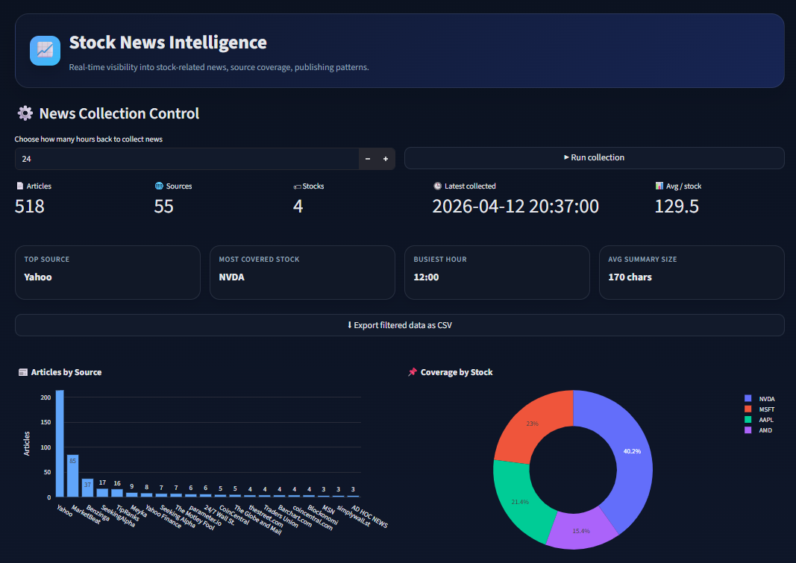
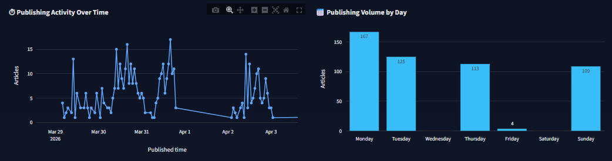
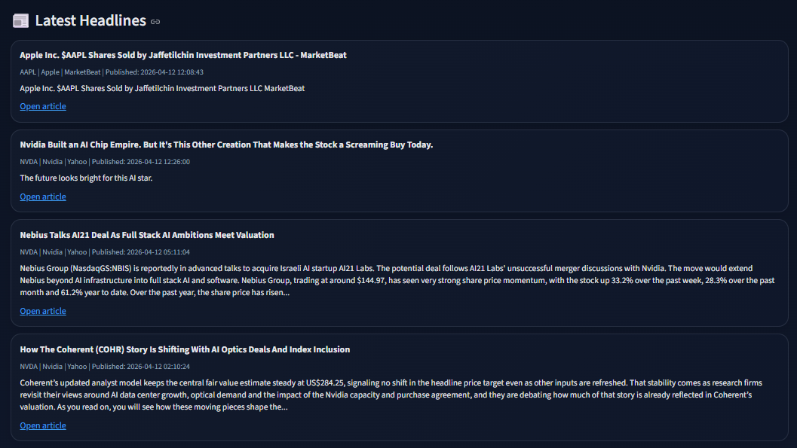
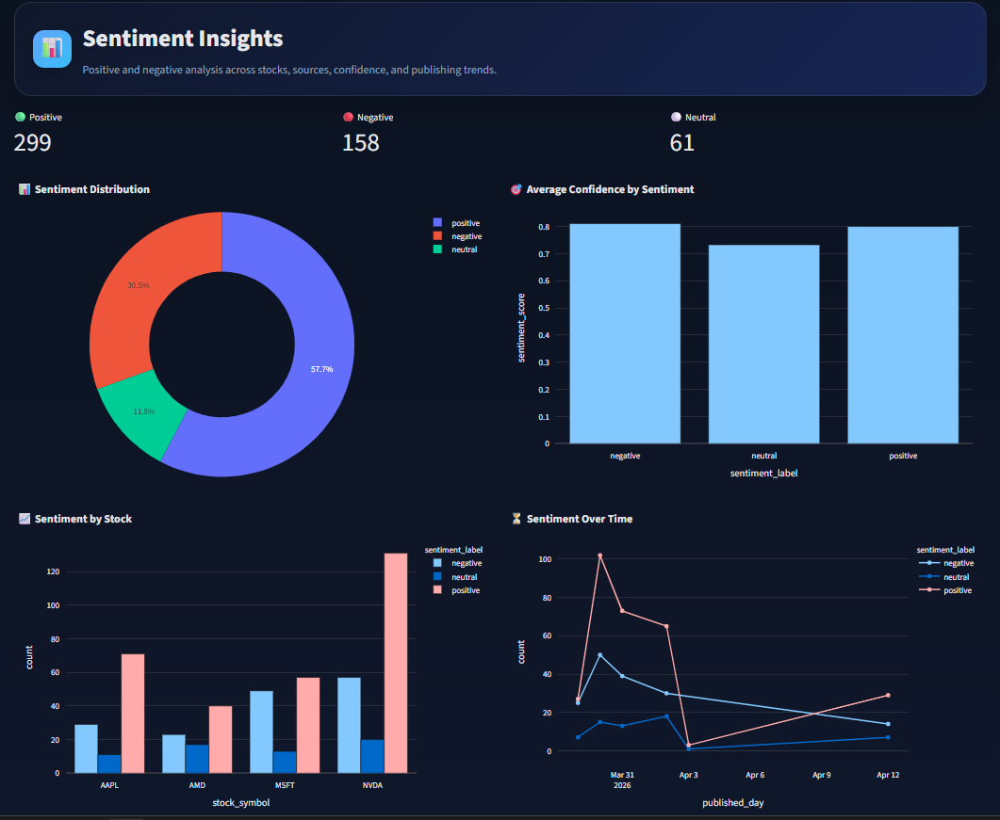
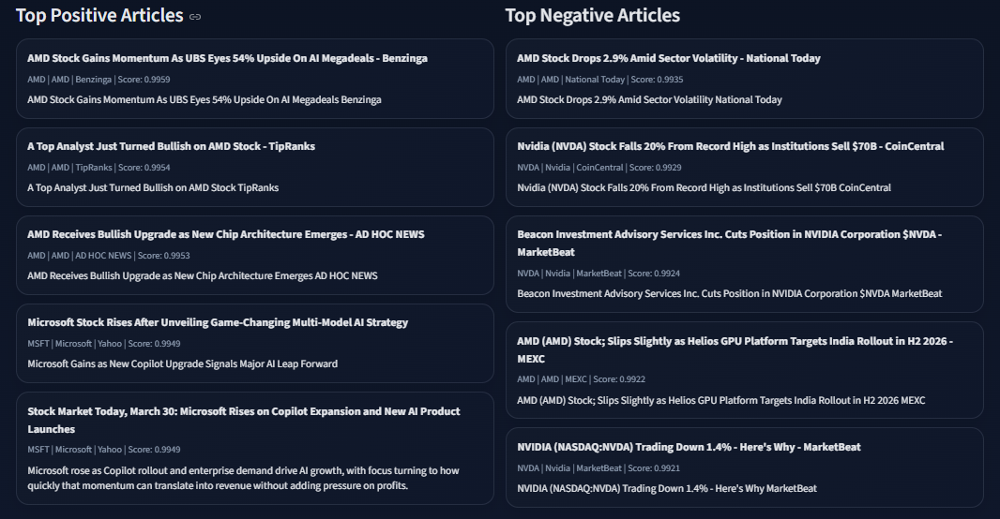
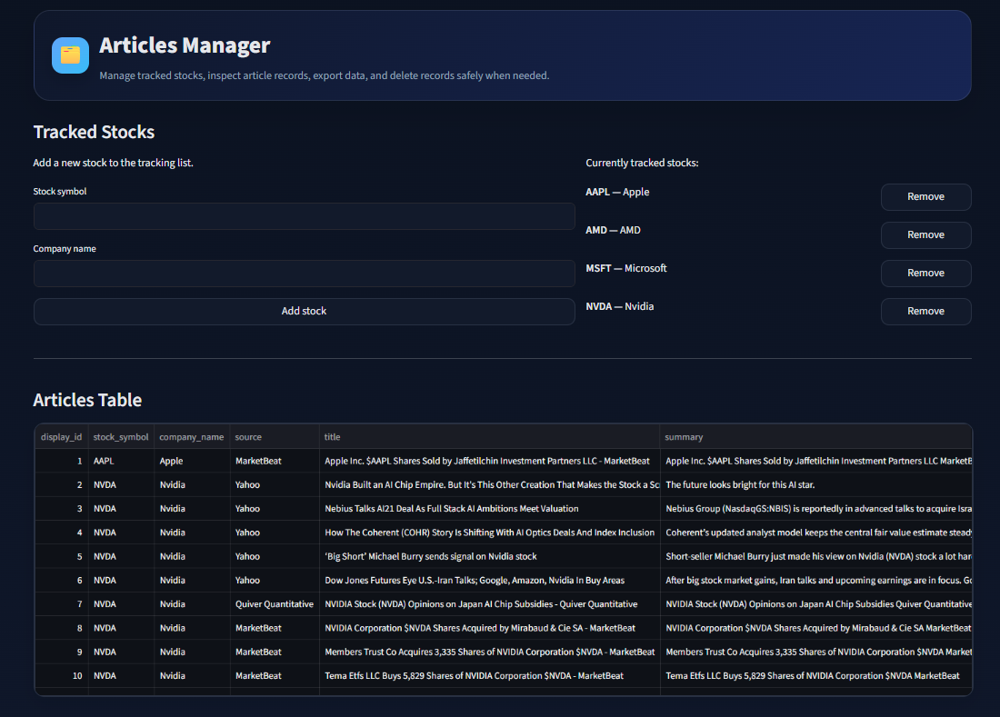
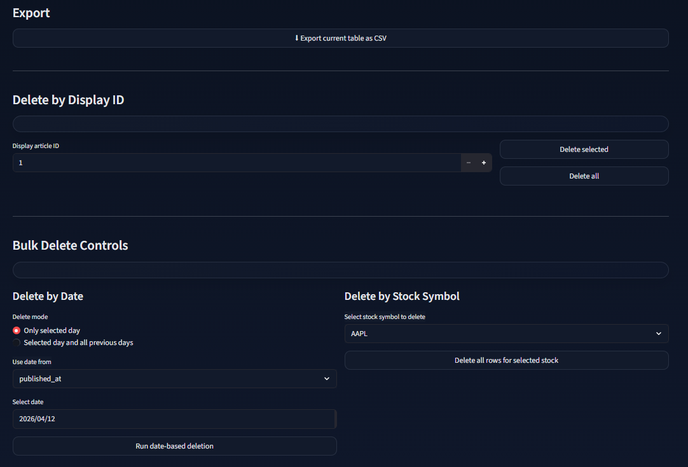

# 🚀 Stock News Sentiment Analysis Dashboard

An end-to-end data science project that collects stock-related news, performs sentiment analysis using a fine-tuned NLP model, stores results in a database, and presents insights through interactive dashboards.

---

## 📌 Overview

This project tracks financial news for selected stocks and classifies each article as:

- 🟢 Positive  
- ⚪ Neutral  
- 🔴 Negative  

The system combines:

- 📡 News collection (APIs & RSS)
- 🗄️ Database storage (SQLite)
- 🤖 Machine Learning (FinBERT-based model)
- 📊 Interactive dashboards (Streamlit)

---

## ✨ Features

- 📰 Collect news from multiple sources  
- 🧠 Sentiment analysis using a fine-tuned model  
- 🗃️ Store articles in SQLite  
- 🚫 Remove duplicates using URL  
- 🔍 Advanced filtering (stock, source, sentiment, time)  
- 📈 Sentiment analysis dashboards  
- 🧾 Export data to CSV  
- 🗑️ Delete and manage data from UI  
- 🌙 Dark themed UI  

---

## 🛠️ Tech Stack

- Python  
- Pandas  
- SQLite  
- Streamlit  
- PyTorch  
- Hugging Face Transformers  
- Finnhub API  
- Google News RSS  

---

## 📂 Project Structure

```bash
stock_news_project/
│
├── app.py
├── dashboard.py
├── config.py
├── requirements.txt
│
├── collectors/
│   ├── finnhub_collector.py
│   └── google_rss.py
│
├── database/
│   └── db.py
│
├── ml/
│   ├── predict.py
│   └── preprocess.py
│
├── training/
│   ├── eda_finbert.py
│   ├── eda_and_clean_dataset.py
│   ├── train_finbert.py
│   └── finetune_finbert_clean_dataset.py
│
├── data/
│   └── news.db
│
└── images/
```

---

## ⚙️ Installation

```bash
git clone https://github.com/YOUR_USERNAME/stock-news-project.git
cd stock-news-project
python -m venv .venv
.venv\Scripts\activate   # Windows
pip install -r requirements.txt
```

Edit `config.py`:

```python
FINNHUB_API_KEY = "YOUR_API_KEY_HERE"
```

---

## ▶️ Usage

### Collect News

```bash
python app.py
```

### Run Dashboard

```bash
streamlit run dashboard.py
```

Open:
```
http://localhost:8501
```

---

## 🧠 Pipeline Overview

1. Collect news from APIs  
2. Filter recent articles  
3. Remove duplicates  
4. Run sentiment prediction  
5. Store in database  
6. Visualize in dashboard  

---

## 🧪 Model Training Strategy

### Stage 1 — Clean Dataset

Initial training was done on a small, high-quality dataset:

**Financial PhraseBank**  
https://huggingface.co/datasets/takala/financial_phrasebank

---

### Stage 2 — Large Noisy Dataset

The model was then fine-tuned on a larger dataset:

**Finance News Sentiments (Kaggle)**  
https://www.kaggle.com/datasets/antobenedetti/finance-news-sentiments

This dataset was:
- cleaned  
- preprocessed  
- normalized  

---

### 🔥 Key Insight

Best performance was achieved by:

- training on clean data first  
- then fine-tuning on larger noisy data  

This improved generalization and overall results.

---

## 🏋️ Training Files

- `eda_finbert.py` — dataset analysis  
- `eda_and_clean_dataset.py` — cleaning and preprocessing  
- `train_finbert.py` — initial training  
- `finetune_finbert_clean_dataset.py` — fine-tuning  

---

## 📊 Dashboards

### 🎛️ Sidebar Navigation & Filters
Provides navigation between pages and shared filters (timezone, stocks, sources, search).



---

### 🏠 Main Dashboard — Overview
Shows collection controls, total articles, number of sources and stocks, and key metrics like top source and busiest hour.



---

### ⏱️ Publishing Activity
Displays how news volume changes over time and across days to identify trends and peaks.



---

### 📰 Latest Headlines
Lists the most recent articles with metadata, summaries, and links to the original sources.



---

### 📈 Sentiment Insights — Charts
Visualizes sentiment distribution, confidence levels, sentiment per stock, and trends over time.



---

### 🏆 Top Sentiment Articles
Shows the most positive and most negative articles based on model confidence.



---

### 🗂️ Articles Manager — Table
Allows viewing tracked stocks and inspecting all collected articles in a structured table.



---

### 🗑️ Articles Manager — Controls
Provides export to CSV, deletion by ID, and bulk deletion by date or stock.



---

## 🗄️ Database Schema

### `news` table

| Column | Description |
|------|------------|
| id | Primary key |
| stock_symbol | Stock ticker |
| source | News source |
| title | Article title |
| url | Unique URL |
| summary | Article summary |
| published_at | Publish time |
| sentiment_label | Sentiment |
| sentiment_score | Confidence |
| collected_at | Insert time |

---

## 💡 Why This Project

- End-to-end pipeline  
- Real-world NLP problem  
- API integration  
- Data cleaning & modeling  
- Interactive dashboard  

---

## 👤 Author

**Zion Memun**  
B.Sc. Data Science and Engineering Student  

---

## 📜 License

For educational and portfolio use.